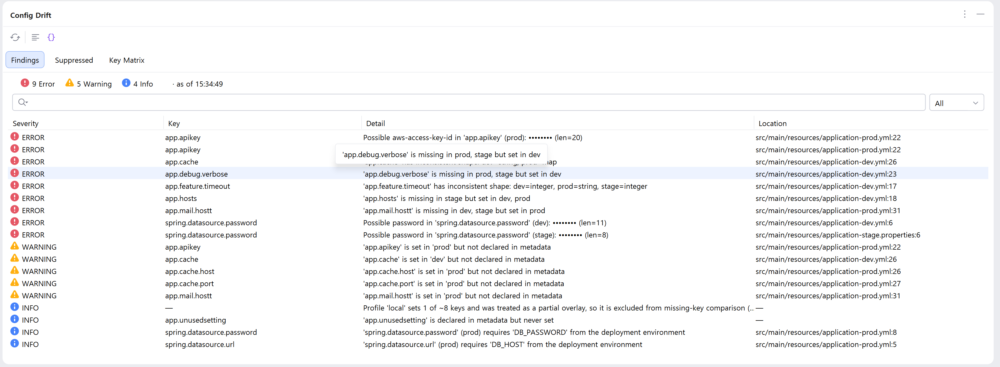
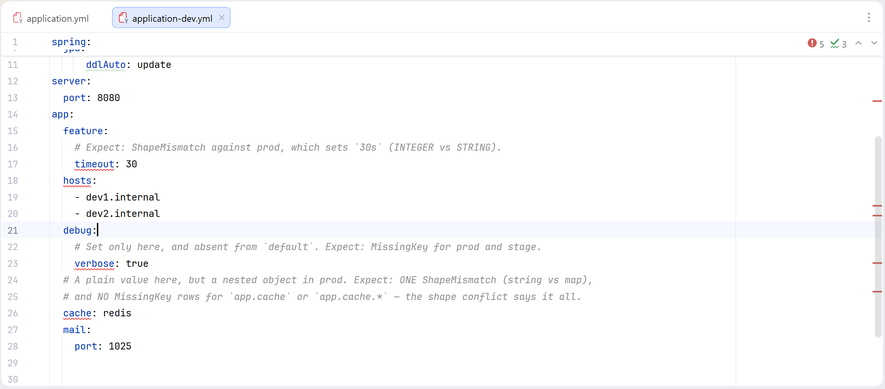
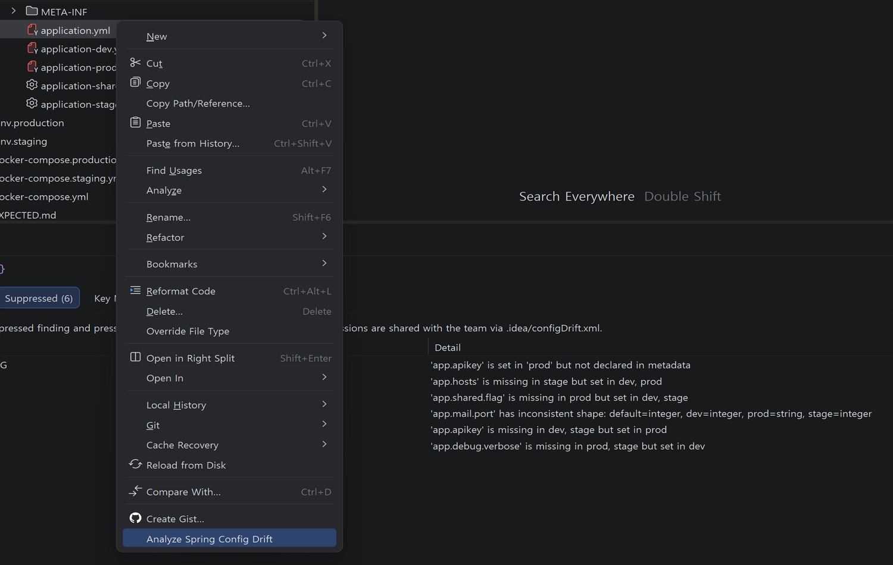
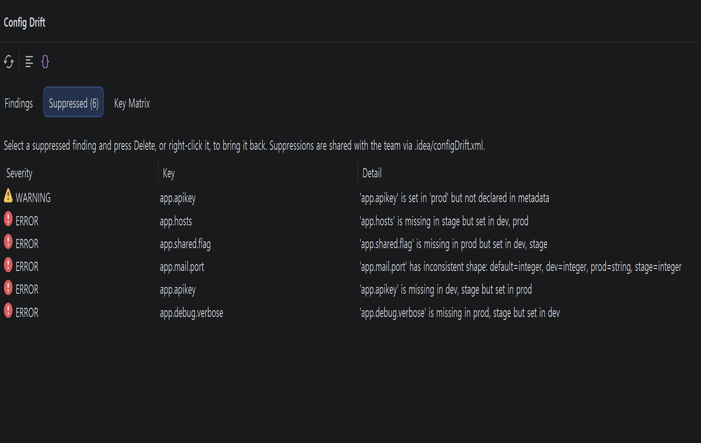
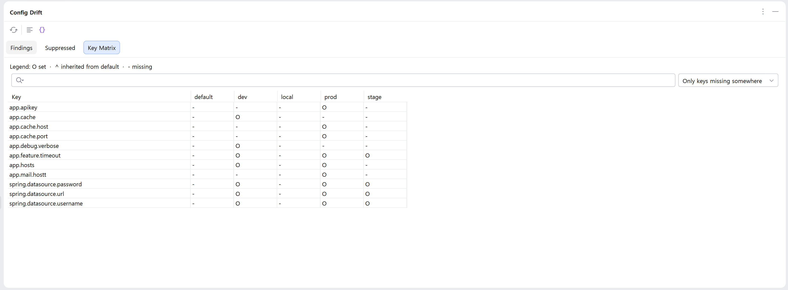
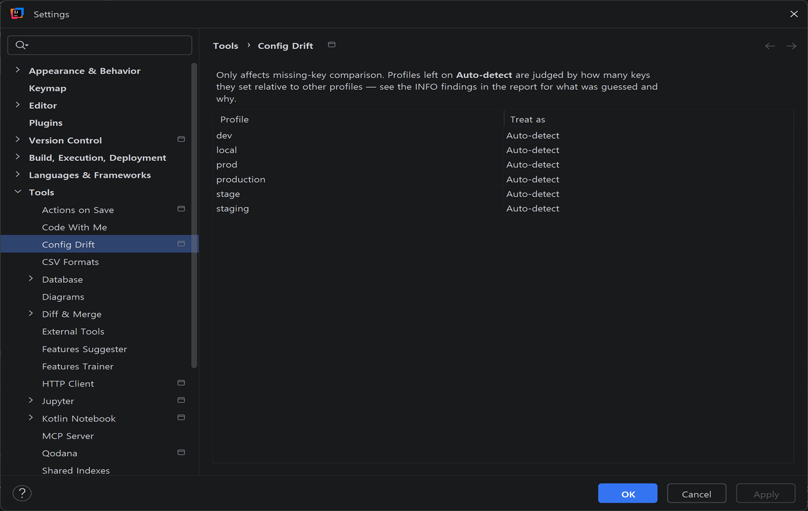

# Spring Config Drift Inspector

[](https://plugins.jetbrains.com/plugin/33357-spring-config-drift-inspector)
[](https://plugins.jetbrains.com/plugin/33357-spring-config-drift-inspector)

Catch broken environment configs before they reach production — right inside IntelliJ.

`Spring Config Drift Inspector` compares every `application*.yml` / `application*.properties`,
`.env`, and `docker-compose*.yml` file in your project across profiles (`default`, `dev`, `stage`,
`prod`, ...) and reports what a code review alone will miss: keys that exist in `dev` but got
dropped from `prod`, a value that's an `int` in one environment and a `String` in another,
credentials committed in plaintext, and `${ENV_VAR}` references that nothing in the repository
actually supplies.



## Why this exists

Two kinds of tools already cover parts of this problem, and both leave a gap:

- **Pure diff plugins** (e.g. Spring Profile Editor, Config Assistant) show you side-by-side
  files, but leave interpretation to you — they don't tell you *which* difference is a bug.
- **Full `@ConfigurationProperties` binders** (e.g. Spring Explyt) reimplement Spring's binding
  rules against your Java/Kotlin classes — powerful, but a large surface area with constant edge
  cases (relaxed binding, records, constructor binding, SpEL, custom converters).

This plugin sits deliberately in between: **static comparison with a lightweight metadata
contract check**, not a Binder reimplementation. It doesn't try to reproduce what Spring does at
runtime — it flags what's inconsistent, missing, or exposed in your files as written.

## What it catches

- ✅ **Missing keys** — set in some profiles, silently absent from others (with default-profile
  inheritance handled correctly, so a key in `application.yml` isn't flagged as "missing"
  everywhere else)
- ✅ **Shape drift** — the same key is a string in one environment and a number, list, or object
  in another
- ✅ **Exposed secrets** — passwords, tokens, API keys, private keys, and credentials embedded in
  URLs, detected by value *and* by key name — masked immediately at detection time, never stored
  or logged in plaintext. Correctly externalized values (`${DB_PASSWORD}`, or
  `postgresql://${DB_USER}:${DB_PASSWORD}@…`) are left alone; only what is actually committed
  (including non-blank placeholder defaults) is flagged
- ✅ **Unresolved placeholders** — `${DB_HOST}` with no default and nothing in the project to
  supply it; reported as INFO/WARNING, never as a hard error, because the plugin can't see your
  real deployment environment
- ✅ **Metadata contract checks** — cross-references `spring-configuration-metadata.json` and,
  when present, your own `@ConfigurationProperties` classes (Java and Kotlin) for keys declared
  but never set, set but never declared, and simple type mismatches
- ✅ **`.env` and Docker Compose support** — the same comparison, secret detection, and
  placeholder analysis apply to `.env`/`.env.<profile>` files and each service's `environment:`
  block in `docker-compose*.yml`/`compose*.yml`, keyed per service so `web`'s and `worker`'s
  variables never collide. Comparisons stay scoped within one config system — a Spring-only key
  is never reported "missing" from an `.env`-only profile
- ✅ **Partial-overlay awareness** — a profile that only overrides a couple of keys
  (`SPRING_PROFILES_ACTIVE=prod,local`-style) isn't mistaken for an incomplete environment. The
  guess is made **within each config system** (Spring / `.env` / Compose separately), shown as an
  INFO finding, and can be overridden per profile in **Settings → Tools → Config Drift**
- ✅ **Relaxed-binding aware** — `driver-class-name`, `driverClassName`, and `DRIVER_CLASS_NAME`
  are recognized as the same property, so renamed-spelling isn't reported as drift

Every finding jumps straight to the exact key in the exact file (`Enter` or double-click), and can
be dismissed with `Delete`, `Alt+Enter`, or a right-click — dismissed findings move to a
**Suppressed** tab rather than disappearing, and stay shared with the team via
`.idea/configDrift.xml`. An exposed secret is the one finding that can't be dismissed: the fix is
to externalize the value, not to agree to stop hearing about it. Reports export as Markdown (for a
PR comment) or JSON (for a CI gate).

Findings also show up as live highlights in the editor, re-checked automatically a couple of
seconds after you save a config file — or after a config file/folder is moved, renamed, or
deleted — no need to keep re-running the analysis by hand:



## What it deliberately does not do

Scope is a feature here, not a limitation to apologize for:

- No full Spring Binder reimplementation — `@ConfigurationProperties` reading is a lightweight PSI
  walk (Java and Kotlin), not semantic type resolution. Nested properties inside a
  `List<CustomType>`/`Map<String, CustomType>` element aren't modeled, only the container itself,
  and for Kotlin specifically, a nested property is only followed into a type declared in the
  same file — cross-file type resolution isn't attempted
- No SpEL, Vault, or Config Server resolution
- No live environment-variable lookup — the plugin only knows what's in your repository
- No `docker-compose`'s `env_file:` references — only values written directly in an
  `environment:` block are compared
- No automatic fixes — it reports, you decide

`@ConfigurationProperties` reading and every config format's parser go through the same
`BindingContractProvider`/`ConfigFileParser` extension points, so deeper binding validation or a
new format later plugs in without reshaping the engine.

## Requirements

IntelliJ Platform 2025.3 or later, with the bundled Java and Kotlin plugins enabled
(`@ConfigurationProperties` detection reads Java/Kotlin PSI directly). IntelliJ IDEA and most
other IDEs on the platform ship both by default.

## Installation

**From the JetBrains Marketplace** (recommended): in your IDE, **Settings/Preferences → Plugins →
Marketplace**, search for "Spring Config Drift Inspector", and install — or install directly from
the [plugin page](https://plugins.jetbrains.com/plugin/33357-spring-config-drift-inspector).

**From a release zip** (for a specific version, or before it's approved on a new IDE release):

1. Download `spring-config-drift-inspector-<version>.zip` from
   [Releases](../../releases), or build it yourself (see below).
2. In your IDE: **Settings/Preferences → Plugins → ⚙ → Install Plugin from Disk...**
3. Select the zip and restart.

### Building from source

```bash
git clone https://github.com/maxmode-now/spring-config-drift-inspector.git
cd spring-config-drift-inspector
./gradlew :spring-config-drift-inspector:buildPlugin
```

The packaged plugin appears at `plugin/build/distributions/*.zip`. Gradle will download a JDK 21
toolchain automatically if one isn't already installed.

### CLI (CI gate)

The same analysis engine is available headless for CI.

**In another Spring repository:** copy
[`docs/examples/github-action-config-drift.yml`](docs/examples/github-action-config-drift.yml)
to `.github/workflows/config-drift.yml`. That workflow downloads the released CLI JAR with
`curl` (no Gradle build of this project required).

**In this repository** (developing or packaging the CLI yourself):

```bash
./gradlew :cli:shadowJar
java -jar cli/build/libs/config-drift-cli-*.jar check --path . --fail-on error
```

| Exit code | Meaning |
| --- | --- |
| `0` | No findings at/above the fail-on threshold (default: ERROR) |
| `1` | Findings at/above the threshold |
| `2` | Bad arguments or unexpected failure |

`--format json|markdown`, `-o FILE`, `--fail-on error|warning|never`, and
`--complete-profile` / `--overlay-profile` are supported.

Full docs, including format-specific gotchas and an FAQ, live in the
[wiki](https://github.com/maxmode-now/spring-config-drift-inspector/wiki).

## Usage

1. Open a project containing `application*.yml` / `.properties`, `.env`, and/or
   `docker-compose*.yml` files.
2. **Tools → Analyze Spring Config Drift** (or right-click a config file and use the same action
   from the context menu) — required once, so there's something to show. After that, saving a
   config file (or moving / renaming / deleting a config file or folder) re-runs the analysis
   automatically.

   
3. Review results in the **Config Drift** tool window, or as inline highlights in the editor:
   - **Findings** tab — every issue, sorted by severity, with a search box and a severity filter.
     `Enter`/double-click jumps to source (or opens Settings, for a finding that's about a profile
     rather than a key); `Delete` or right-click dismisses.
   - **Suppressed** tab — everything dismissed from Findings, restorable the same way:

     
   - **Key Matrix** tab — every key against every profile, searchable, with a toggle to show only
     keys missing from at least one profile. `O` means set, `^` means inherited from that system's
     `default`, `-` means missing, and `~` means not applicable (the key's config system doesn't
     apply to that profile — including when another system's `default` would otherwise look
     inherited):

     
4. Override the partial-overlay guess per profile in **Settings → Tools → Config Drift**, if a
   profile gets misclassified:

   
5. Export via the toolbar (**Copy Markdown Report** / **Copy JSON Report**) for a PR description
   or a CI check.

## Development

```bash
./gradlew test                                      # :core + plugin unit tests
./gradlew :cli:shadowJar                            # headless CI binary
./gradlew :spring-config-drift-inspector:runIde     # sandbox IDE with the plugin installed
./gradlew :spring-config-drift-inspector:verifyPluginProjectConfiguration
```

A worked example with an intentional mix of every finding type lives in
[`plugin/testFixtures/sample-spring-project`](plugin/testFixtures/sample-spring-project), along with an
[expected-results checklist](plugin/testFixtures/sample-spring-project/EXPECTED.md).

## Contributing

Issues and pull requests are welcome. If you're proposing a new detection rule, include a
before/after example — false positives are taken seriously here, since a noisy inspection is one
users turn off.

## Privacy

The plugin analyzes configuration locally and does not send project data to the author.
See [PRIVACY.md](PRIVACY.md).

## License

[MIT](LICENSE)
